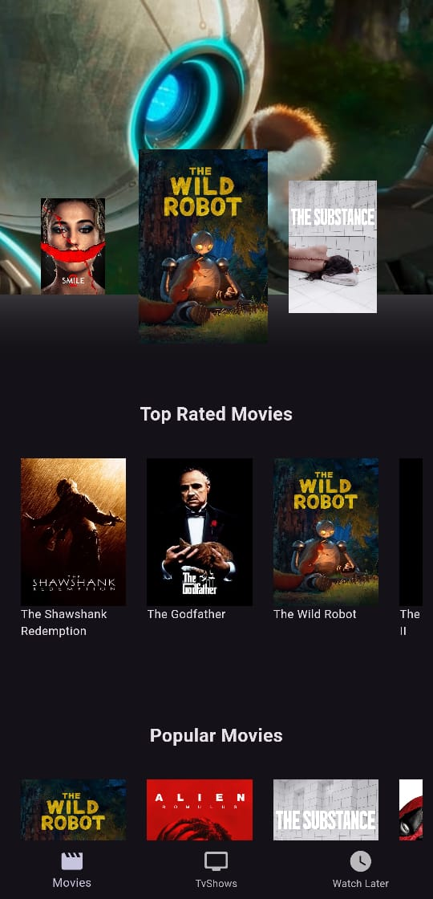
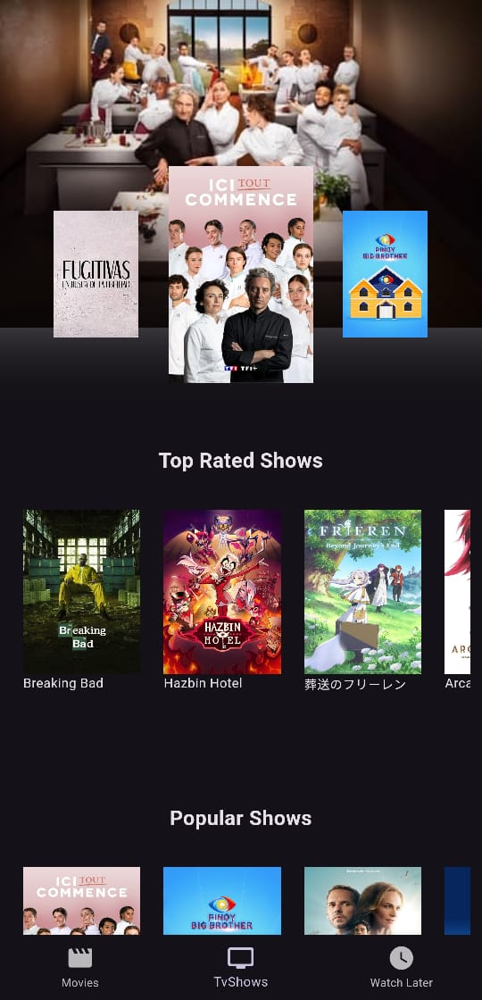

# Cinemagic App

Cinemagic is a Flutter application that allows users to explore and preview top-rated, Popular and currently playing movies and TV shows using the TMDB API. The app features a "Watch Later" section, customizable user interactions, and a visually engaging interface to enhance the movie and TV show discovery experience.

## Features

- **Movie & TV Show Previews**: Display detailed information about movies and TV shows, including:
  - Title
  - Rating
  - Release date
  - Overview
  - Background image
  - Similar movies/TV shows
- **Watch Later Section**: Users can save their favorite movies and TV shows for later viewing, even after closing the app.
- **ImageSlider**: Showcases Now Playing movies/TV shows with automatic playback of movies/TV shows posters and backgrounds.
- **Top Rated Section**: Displays a selection of the top 10 movies/TV shows.
- **Popular Section**: Displays a selection of the top 10 movies/TV shows.
- **Bottom Navigation Bar**: Easily navigate between Movies, TV Shows, and the Watch Later section.
- **Loading and Connectivity**: The app includes a loading screen to ensure smooth data fetching when opening or navigating. If the phone has no internet connection, a message will appear, informing the user of the issue.
- **Responsive Design**: Adaptable layout for different screen sizes, with smooth resizing animations.
- **Dark/Light Theme Support**: The app supports both dark and light themes, providing a comfortable viewing experience in different lighting conditions.

## Dependencies

- `tmdb_api`: ^2.2.0 - A Flutter library for accessing the TMDB API.
- `carousel_slider`: ^5.0.0 - A package for implementing carousel sliders for image galleries.
- `url_launcher`: ^6.3.1 - A Flutter plugin for launching URLs in the mobile platform.
- `flutter_riverpod`: ^2.6.0 - A robust and flexible state management solution for Flutter applications.
- `shared_preferences`: ^2.3.2 - A Flutter plugin for persisting simple data across app launches.

## Screenshots

  
  

Home Screen: Explore a wide range of movies/tv shows with detailed previews and easy navigation.

  
  

Watch Later: Save your favorite movies and shows for convenient access anytime.
Movie Info: Get in-depth details about your selected movie, including ratings and overviews.