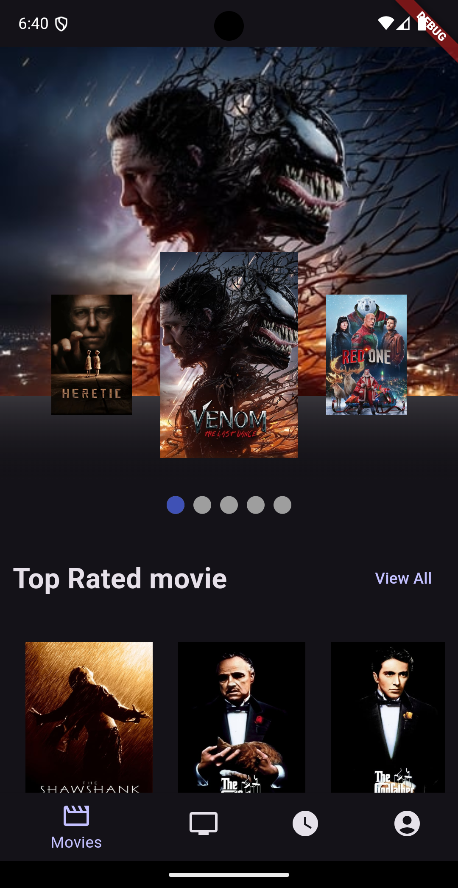
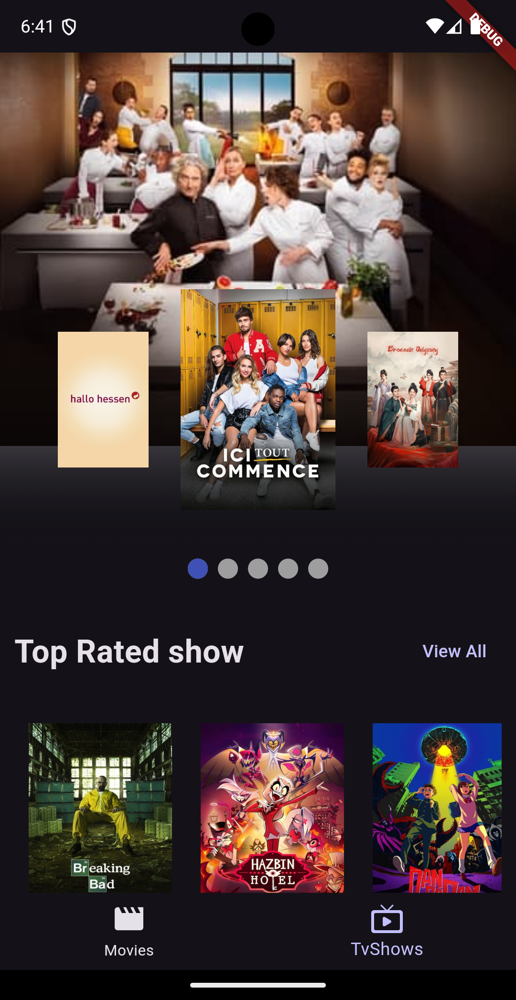
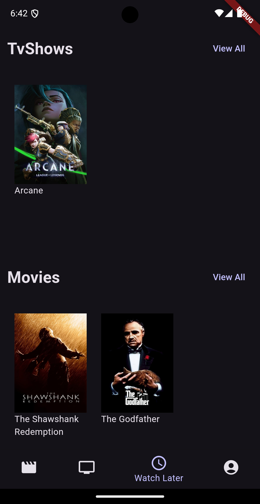
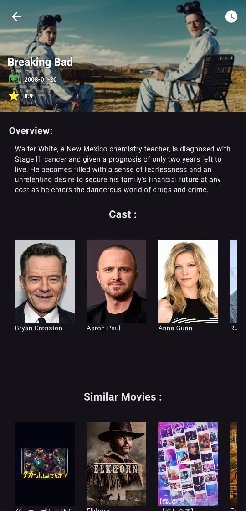
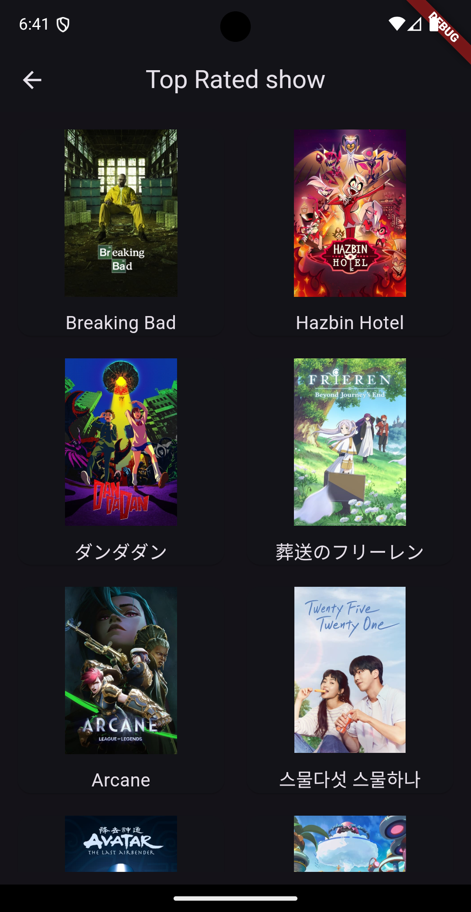

# Cinemagic App


Cinemagic is a Flutter application that allows users to explore and preview top-rated, Popular and currently playing movies and TV shows using the TMDB API. The app features a "Watch Later" section, customizable user interactions, and a visually engaging interface to enhance the movie and TV show discovery experience.

## Features

- **Movie & TV Show Previews**: View essential details like title, rating, release date, and overview for each movie/show.
- **Now Playing Preview with Carousel Slider**: View now-playing movies/TV shows in a visually engaging carousel slider with smooth page indicators, allowing users to effortlessly scroll through featured content.
- **Watch Later**: Save movies and shows for future viewing, accessible even after closing the app.
- **Top Rated & Popular Sections with Endless Scroll**: Easily browse top-rated and popular movies/TV shows, with smooth scrolling and navigation. Access an endless list of movies/shows by clicking the "View All" button, which loads more items as you scroll down.
- **Responsive Design & Dark/Light Themes**: Enjoy seamless adaptation to different screen sizes and themes for a comfortable experience in various lighting.
- **User Authentication**: Sign up, log in, log out, or use the app anonymously with Firebase Authentication.
- **Data Caching**: Faster loading on subsequent app launches with cached data.
- **Bottom Navigation & Page Indicators**: Effortless navigation between Movies, TV Shows, and Watch Later sections with stylish page indicators.

## Dependencies

- `tmdb_api: ^2.2.0` A Flutter library for accessing the TMDB API.
- `carousel_slider: ^5.0.0` A package for implementing carousel sliders for image galleries.
- `url_launcher: ^6.3.1` A Flutter plugin for launching URLs in the mobile platform.
- `flutter_riverpod: ^2.6.0` A robust and flexible state management solution for Flutter applications.
- `shared_preferences: ^2.3.2` A Flutter plugin for persisting simple data across app launches.
- `smooth_page_indicator: ^1.2.0+3` A Flutter package for creating customizable page indicators with smooth animations.
- `flutter_dotenv: ^5.2.1` A Flutter package for securely managing environment variables in your Flutter app, such as API keys.
- `firebase_core: ^3.8.1` A Flutter plugin to initialize and interact with Firebase.

- `firebase_auth: ^5.3.4` A Firebase plugin for user authentication.

- `fluttertoast: ^8.2.10` A Flutter package for displaying toast notifications.

- `flutter_screenutil: ^5.9.3` A package for responsive design and scaling of Flutter widgets.

## .env File

The application uses a `.env` file located in the `lib/` path. Below is an example of its content:

```
apiKeyV3 = '..........'
apiReadAccessTokenv4 = '..............'
```

## Firebase Configuration

The app requires a `firebase_options.dart` file to handle Firebase initialization. This file is auto-generated based on your Firebase project configuration. To create it, run the following command:

```
flutterfire configure
```

Ensure this file is included in your project to enable Firebase features.

## Screenshots

<p float="left">
  
  
</p>

_Home Screen_: Explore a wide range of movies and TV shows with detailed previews and easy navigation.

`On the left`: Personalized experience for logged-in users.

`On the right`: Simplified interface for guest users.

<p float="left">
  
  
</p>

_Watch Later_: Save your favorite movies and shows for convenient access anytime.

_Movie Info_: Get in-depth details about your selected movie, including ratings and overviews.

<p float="left">
  
</p>

_View All_: Browse an endless list of popular/top-rated movies/shows, with new items loading as you scroll.
